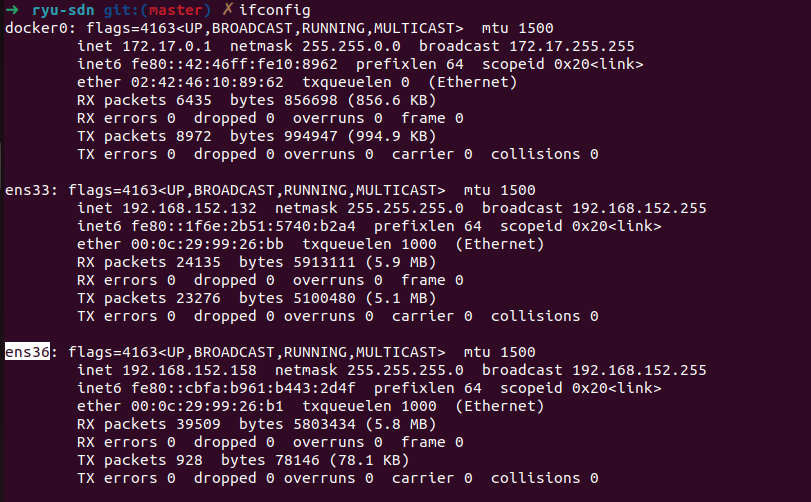

# RYU - SDN

### Yêu cầu:

- RYU ( hoặc docker)
- Mininet

### Hướng dẫn cài đặt

- Trên máy ảo, thêm một card Nat ( ở đây tên interface là ens36). Nếu tên interface khác thì sửa trong file define.py

- Chạy topology mininet:

```bash
sudo python3 topology.py
```

- Chạy controller:

```bash
docker run -it -p 6633:6633  -v path_code_clone:/root/ryu --rm linton/docker-ryu /bin/bash
cd /root/ryu
ryu-manager controller.py
```